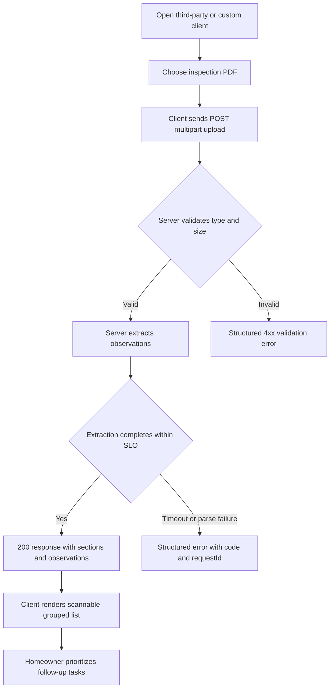
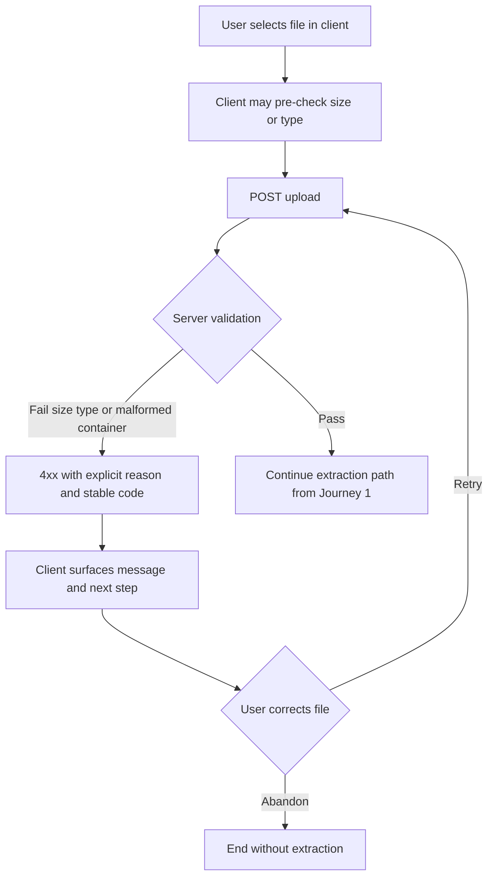
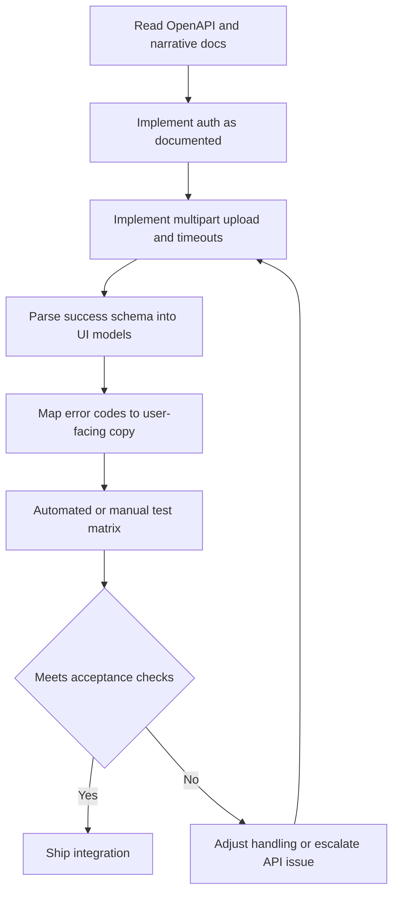
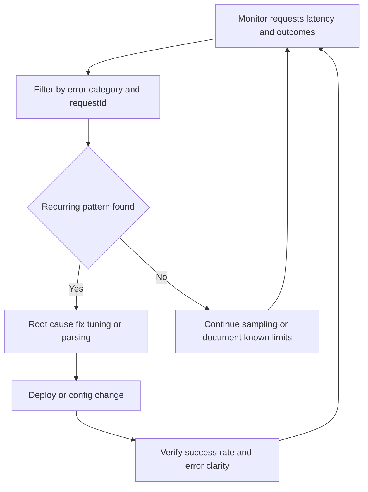

---
stepsCompleted:
  - 1
  - 2
  - 3
  - 4
  - 5
  - 6
  - 7
  - 8
  - 9
  - 10
  - 11
  - 12
  - 13
  - 14
lastStep: 14
status: complete
completedAt: "2026-05-04"
workflowType: ux-design
inputDocuments:
  - _bmad-output/planning-artifacts/prd.md
  - _bmad-output/planning-artifacts/architecture.md
  - _bmad-output/project-context.md
---

# UX Design Specification homeinspection

**Author:** kev
**Date:** 2026-05-04

---

<!-- UX design content will be appended sequentially through collaborative workflow steps -->

## Executive Summary

### Project Vision

Deliver a dependable, fast API that turns dense home inspection PDFs into structured, section-linked observations so homeowners—through whatever client they use—can quickly grasp priorities and treat the result as a starting to-do list, not a substitute for the full report or professional advice.

### Target Users

- **Homeowners:** Need quick orientation and actionable lists; vary in technical comfort; interact via third-party or custom clients in V1.
- **API integrators:** Need stable contracts, clear validation vs extraction failures, and documentation-led onboarding.
- **Operators:** Need correlated logs and error categories to keep the prototype within SLOs.

### Key Design Challenges

- Calibrating expectations when extraction is intentionally "good enough," not perfect.
- Designing error and success payloads that are equally usable for humans (via clients) and machines.
- Providing a strong API "out-of-box experience" without a first-party UI in Phase 1.

### Design Opportunities

- JSON and OpenAPI structured around to-do-oriented mental models (section groupings, scannable observation units).
- Consistent request correlation and error taxonomy as a product-quality signal.
- Clear extension path for a future homeowner UI without contract churn.

## Core User Experience

### Defining Experience

The core loop is submitting a home inspection PDF and receiving structured, section-linked observations within the service time budget, or receiving a deterministic, typed error that supports immediate correction and retry. Client applications translate this loop into homeowner-facing flows; the API itself is the primary designed experience in Phase 1.

### Platform Strategy

Phase 1 is an HTTP JSON API with multipart upload, consumed by integrators and indirect homeowner experiences across web, mobile, or desktop clients. The contract is platform-neutral. A first-party homeowner UI is explicitly out of scope for Phase 1 and planned as a later phase without breaking v1 semantics.

### Effortless Interactions

- A valid PDF upload completes as a single request with a predictable success envelope suitable for direct rendering or light transformation into a to-do list.
- Invalid inputs fail fast with explicit reasons (type, size, malformed PDF) before expensive processing.
- Success responses emphasize section grouping and scannable observation units to reduce cognitive load for downstream UIs.

### Critical Success Moments

- First successful extraction: the user sees an organized observation list and can mentally map it to next actions within one review pass.
- First failure: the user understands what went wrong and can correct the input without contacting support.
- First integration: a developer can map success and error handling confidently using published API contracts.

### Experience Principles

1. **Clarity over cleverness:** predictable structures and codes over implicit or overloaded fields.
2. **Honest limits:** communicate good-enough extraction and non-legal use so clients set correct homeowner expectations.
3. **Recoverable by default:** structured errors, stable codes, and request correlation for every failed path.
4. **Dual consumption:** payloads must work equally well for human-presenting clients and programmatic consumers.

## Desired Emotional Response

### Primary Emotional Goals

Users should feel relieved and oriented: the inspection report stops feeling like an impenetrable wall and becomes a scannable set of actions. Integrators should feel the product is trustworthy and boring-in-a-good-way: contracts, errors, and timing behave as documented.

### Emotional Journey Mapping

- Before upload: low-grade anxiety or fatigue from dealing with a long technical document.
- During processing: patient trust that the request is bounded and will resolve with a clear outcome.
- After success: relief and mental clarity; a sense of momentum toward next steps.
- After failure: supported problem-solving rather than blame; confidence that retry is worthwhile.
- On repeat use: reduced anxiety due to predictable patterns and recoverable errors.

### Micro-Emotions

Prioritize confidence over confusion, trust over skepticism, and accomplishment over frustration. Avoid helplessness from opaque failures, distrust from overstated accuracy claims, and unnecessary alarm from legalistic framing inappropriate to homeowner exploration use.

### Design Implications

- Relief through structure: section grouping and observation scannability in success payloads (and mirrored in any client UI later).
- Trust through transparency: stable error codes, request correlation, and explicit failure categories.
- Honesty through positioning: client-facing language should reflect good-enough extraction and non-legal use where relevant.
- Calm failures: action-first guidance, minimal internal jargon in externally visible fields.

### Emotional Design Principles

1. Orient, do not overwhelm.
2. Be honest about limits while remaining helpful.
3. Make failures feel fixable.
4. Treat integrators as first-class users of the experience.

## UX Pattern Analysis & Inspiration

### Inspiring Products Analysis

**Stripe (API and docs)** — Treats the API surface as a product: consistent error objects, human-readable messages alongside machine codes, and documentation that reads like a guided path. Reduces integrator anxiety and speeds first success.

**GitHub / well-run REST APIs** — Predictable resource semantics, correlation-friendly responses, and changelogs that respect integrators. Builds long-term trust for a single-endpoint v1 that may grow.

**High-quality "inbox / checklist" apps (e.g. Things, Reminders, Linear-style lists)** — Strong hierarchy, grouping, and scanability. Not in scope for V1 server work, but they set the bar for how **sectioned observations** should feel when rendered by clients.

### Transferable UX Patterns

- **Structured errors everywhere:** code + message + optional details + stable `requestId` (Stripe-like), so failures feel actionable.
- **Documentation as onboarding:** OpenAPI plus narrative "happy path + failure matrix" so the first integration lands without guesswork.
- **Bounded async feel:** explicit timeouts and size limits in docs and responses so waiting feels intentional, not broken.
- **Payloads as UI primitives:** nested sections and observation units that map directly to list/group UI later (checklist-app hierarchy without shipping a UI).

### Anti-Patterns to Avoid

- Opaque 500s or generic "Something went wrong" without codes or correlation IDs.
- Silent truncation or partial success without signaling quality limits.
- Overstating accuracy or legal weight in field names or example copy.
- Inconsistent naming between docs, OpenAPI, and runtime JSON (breaks trust fast).

### Design Inspiration Strategy

**Adopt:** Stripe-class error shape discipline; GitHub-class predictability and versioning posture for future evolution; checklist-style information hierarchy in JSON only.

**Adapt:** "Delight" is subdued—prefer clarity and speed over personality in API fields; any friendly tone lives in docs and client apps, not in overloaded response payloads.

**Avoid:** Wizard-heavy or UI-specific assumptions in the core contract; novelty for its own sake in error formats; hiding limits until after an expensive upload.

## Design System Foundation

### 1.1 Design System Choice

**Phase 1 (current scope):** An **API-first design system**—OpenAPI as the single source of truth, consistent resource and field naming, a stable error envelope (codes, messages, `requestId`), and documentation patterns that behave like a product surface. No shipped component library or visual tokens in this phase.

**Phase 2+ (first-party homeowner UI, when prioritized):** Default candidate—**themeable system built on accessible primitives** (e.g. **Radix UI + Tailwind CSS**, often via **shadcn/ui** patterns) so components are copy-owned, brandable, and WCAG-friendly without locking to a single vendor look. Final pick to be confirmed when UI scope is funded.

### Rationale for Selection

- Aligns with **API-only** delivery: integrators need **predictability**, not prebuilt screens.
- Avoids paying for visual DS work before there is an app to style.
- Defers visual uniqueness until brand and IA exist, while **encoding** list/section hierarchy in JSON today.
- When UI lands, Radix-style primitives + tokens support **emotional goals** (calm, clarity) and **inspiration** (checklist/inbox scanability).

### Implementation Approach

- **Now:** Version OpenAPI; lint breaking changes; exemplify success and error payloads in docs; keep field names stable and human-scannable in client renderings.
- **Later:** Introduce design tokens (color, type, spacing, elevation) and a small set of layout primitives (page shell, list, section header, observation row) mapped to the JSON section/observation model.

### Customization Strategy

- **API layer:** "Customize" via additive optional fields and documented extension points, not ad-hoc synonyms or undocumented conventions.
- **UI layer (future):** Start from neutral defaults; layer brand (palette, typography, corner radius) through tokens; reserve dense legal/report disclaimers for dedicated, low-emphasis components so primary lists stay calm.

## 2. Core User Experience

### 2.1 Defining Experience

**"Drop the inspection PDF, get a scannable to-do list—or a clear fix."** If that single exchange is excellent, integrators ship faster and homeowners (via clients) feel the product's value without extra ceremony.

### 2.2 User Mental Model

Users implicitly think **"something should read this dense report for me"**—not replace a lawyer or contractor, but **reduce paralysis**. They expect **one file in**, **one structured answer out**, within a **bounded wait**, and they distinguish **"you sent the wrong thing"** from **"we couldn't parse this PDF."** Confusion spikes when limits, timing, or extraction quality are hidden or overstated.

### 2.3 Success Criteria

- **Orientation:** In one pass, a reader can identify major sections and individual observations without hunting through flat text.
- **Trust:** Every response carries **correlation**; failures include **stable codes** and human-readable reasons suitable for UI or logs.
- **Honesty:** Success payloads and docs do not imply legal-grade completeness; gaps are tolerable if structure and next steps are clear.
- **Performance feel:** The interaction **fits published limits** (size, time); when slow, it still feels **intentional and bounded**, not stuck.

### 2.4 Novel UX Patterns

Predominantly **established** patterns: **HTTP multipart upload**, **JSON success envelope**, **structured client errors**. The **differentiator** is **domain-shaped structure** (inspection sections, observation units, optional severity or tags as defined in OpenAPI)—not a new interaction paradigm, so **education burden stays low** for integrators.

### 2.5 Experience Mechanics

1. **Initiation** — User or client has a **PDF** (or obtains it from email/portal); client **validates size/type** early when possible, then starts **POST** upload with auth as documented.
2. **Interaction** — Single request: **multipart file + metadata** as required; server **validates**, then **extracts**; no mandatory multi-step wizard in v1.
3. **Feedback** — **Progress** is communicated by **documented latency behavior** and **deterministic errors** for bad inputs; success returns **nested sections → observations** optimized for **list rendering**.
4. **Completion** — Client receives **complete JSON** for the request; user sees **grouped observations** (in client UI) or integrator stores/pipelines them; **errors** invite **correction and retry** (smaller file, different PDF, fix auth) without dead ends.

## Visual Design Foundation

### Color System

No project-specific brand palette was supplied in this workflow; treat **neutral, low-noise** colors as the default until brand tokens exist.

**Semantic intent (for future UI and status presentation):**

- **Canvas / background:** warm-neutral off-white or cool-neutral gray-50—reduce glare for long reading sessions.
- **Primary / interactive:** restrained blue-green or slate-blue—professional, calm, not "alarm" red.
- **Success:** clear green with documented **non-color** companion (icon/label) for extraction-complete states.
- **Warning / caution:** amber for "usable but imperfect" extraction or advisory copy—not confused with hard errors.
- **Error:** deep red reserved for **blocking** failures and validation errors; pair with text and icons.

**Docs and API-only phase:** Prefer **semantic names** in design tokens (`--color-danger`, `--color-caution`) over raw hex in specifications; lock concrete values when UI ships.

### Typography System

**Tone:** modern, approachable, **plain-spoken**—homeowners are the eventual audience; avoid overly technical or legal display faces for primary lists.

**Future UI stack (aligned with step 6 default):**

- **Primary:** system UI stack first (`system-ui`, `Segoe UI`, `Roboto`, `San Francisco`) for performance, familiarity, and accessibility; optional webfont later if brand requires it.
- **Scale:** modular scale for **page title → section header → observation title → body → meta/caption**; body **16px minimum** on mobile targets where homeowners read.
- **Density:** slightly generous **line-height** for observation bodies (long clauses from reports); **tighter** line-height for metadata (codes, timestamps).

### Spacing & Layout Foundation

- **Base unit:** **4px** grid, **8px** as the default step for padding between related items; **16–24px** between sections to reinforce hierarchy (matches checklist/inbox inspiration).
- **Layout feel:** **airy lists** with clear separation between observations; avoid ultra-dense tables for primary homeowner flows.
- **Structure:** single-column **mobile-first** stack for observation review; optional two-column **summary + detail** on larger breakpoints later.

### Accessibility Considerations

- Target **WCAG 2.2 AA** minimum for text and UI chrome when a client exists; verify **focus rings** and **keyboard** order for any interactive list or filter UI.
- **Never rely on color alone** for severity or status; combine **label, icon, and pattern** (e.g. outlined vs filled).
- Respect **user font scaling** and **reduced motion** preferences for any progress or transition around upload/wait states in clients.
- For **Phase 1 API**, ensure **example JSON and docs** remain readable (contrast in rendered docs sites if you publish one).

## Design Direction Decision

### Design Directions Explored

Six exploratory directions are captured in `_bmad-output/planning-artifacts/ux-design-directions.html`:

1. **Calm neutral** — airy list, light borders, professional badges (baseline aligned with Visual Design Foundation).
2. **Warm friendly** — cream canvas, softer language labels ("Heads up", "FYI").
3. **Dense efficient** — monospace, compact rows; integrator or power-user tone.
4. **High contrast** — dark canvas, bold borders; accessibility-forward presentation.
5. **Split summary + detail** — two-column master–detail for desktop review.
6. **Soft cards** — gentle shadows on stacked cards, indigo-tinted atmosphere.

### Chosen Direction

**Provisional default:** **Direction 1 (Calm neutral list)** as the baseline for a first homeowner UI, pending stakeholder review of the HTML showcase. **Overrides:** If accessibility testing favors stronger contrast, adopt **Direction 4** tokens for text and background while keeping **Direction 1** layout hierarchy, or combine with **Direction 5** for large screens only.

### Design Rationale

Direction 1 best matches relief, orientation, and calm from the emotional response goals, stays close to checklist and inbox inspiration without gimmicks, and maps cleanly to section-to-observation JSON. Warm (2) or soft cards (6) remain optional brand layers once a palette is finalized.

### Implementation Approach

- When UI work starts: implement Direction 1 in the chosen component stack (see Design System Foundation), tokenize colors, type, and spacing, then user-test with real inspection-length copy.
- Reserve Direction 3 patterns for internal or integrator tools, not default homeowner surfaces.
- Revisit the split layout (5) at large breakpoints if observation volume is high.

## User Journey Flows

### Journey 1 — Homeowner success path (primary)

**Narrative (from PRD):** Maya uses a client app to upload a long inspection PDF, waits within the expected window, and receives observations grouped by section so she can build a mental to-do list without reading every page.

**Flow:** Open client → choose PDF → upload → bounded wait → receive structured list → scan by section → prioritize next steps.

### Journey 2 — Homeowner recovery path (validation and retry)

**Narrative (from PRD):** Derek exceeds the 20 MB limit or sends a non-PDF; the API rejects early with a clear error; he fixes the file and retries successfully.

**Flow:** Upload → fast validation failure → readable error in client → corrective action → retry → success path alignment with Journey 1.

### Journey 3 — API consumer and integrator path

**Narrative (from PRD):** A partner developer wires the endpoint into a homeowner app; deterministic success and failure contracts reduce guesswork and speed shipping.

**Flow:** Read OpenAPI and examples → implement auth and multipart → map JSON to UI models → handle error taxonomy → test edge cases → release.

### Journey 4 — Operations and prototype maintainer path

**Narrative (from PRD):** Kev monitors outcomes, classifies failures, and tunes handling so the prototype stays credible.

**Flow:** Observe traffic and logs → slice by outcome and error class → identify recurring pattern → change config or code → verify improved rates and clarity.

### Journey Patterns

- **Single-shot core loop:** one upload maps to one terminal outcome per request (success or structured failure), simplifying client state machines.
- **Fail fast on validation:** invalid files never enter expensive parsing when avoidable, matching user expectation of immediate feedback.
- **Correlation everywhere:** `requestId` ties homeowner-visible errors, integrator logs, and operator traces.
- **Dual rendering:** the same JSON supports human list UI and programmatic storage, so integrators and ops see the same truth.

### Flow Optimization Principles

- **Minimize steps to value:** client-side pre-checks where cheap; server validation as authoritative; avoid extra round trips for v1.
- **Reduce cognitive load:** group observations by section; keep error messages action-first (what to change, then why).
- **Bounded waiting:** document expected timing and limits so the wait state feels intentional, not broken.
- **Graceful degradation:** extraction limitations are honest in copy and optional metadata rather than silent omissions.

## Component Strategy

### Design System Components

**Phase 1 — API and documentation surface (no visual component library):**

- **Documented request shape:** multipart upload with a single file field and conventions described in OpenAPI.
- **Success envelope:** versioned JSON root with nested **sections** and **observations** as defined in the contract (the "atoms" integrators map to UI later).
- **Error envelope:** stable `code`, human-readable `message`, optional structured `details`, and `requestId` on every failure path.
- **Reference and examples:** runnable or copy-paste **request/response examples** and a **failure matrix** in docs (treated as first-class product components).

**Phase 2+ — Planned UI foundation (from Design System Foundation):**

- Primitives from the chosen stack: **button, input, label, dialog, toast, scroll-area, list, card, badge, separator, skeleton**—used compositionally rather than bespoke where possible.

### Custom Components

**Domain-specific (future homeowner client; not in Phase 1 server scope):**

1. **Observation list item** — One observation with optional severity or category **badge**, primary text, optional secondary line (source snippet or location), and non-color status affordance. States: default, expanded (optional), disabled (if read-only mode).
2. **Section group header** — Section title, optional count, sticky behavior on long lists at `md+` if needed.
3. **Upload and progress region** — File picker, size/type hint (20 MB, PDF), **bounded wait** messaging, cancel if client supports it, transition to results or inline error.
4. **Structured error panel** — Maps API `code` + `message` + `requestId` to action-first copy and "copy request id" for support; variants for validation vs extraction vs rate limit.
5. **Disclaimer strip** — Short, persistent framing that output is a **starting to-do list**, not legal advice or a full report replacement (aligns with PRD positioning).

**API-only "custom" behaviors:** consistent **problem+json** or project error JSON shape, **log field names** matching OpenAPI, and **example fixtures** for integrator tests.

### Component Implementation Strategy

- **Phase 1:** Implement behavior and payloads in the API; generate or hand-maintain **OpenAPI** and **markdown** so the "components" are contract and docs. Add **fixture JSON** for success and representative errors to support integrator and client development without UI.
- **Phase 2+:** Build UI from **tokens + primitives**, then add the **five custom** pieces above as thin compositions. Share **badge semantics** and typography with the design direction showcase (Direction 1 baseline).
- **Accessibility:** custom items inherit primitive focus rings; observation rows are **keyboard navigable** list or tree semantics; error panel exposes **`requestId` in plain text** for screen readers and copy.

### Implementation Roadmap

**Phase 1 — Core (shipping the API):**

- Error envelope + codes + `requestId` — blocks all journey error paths.
- Success schema (sections → observations) — blocks Journey 1 and 3.
- OpenAPI + examples + failure matrix — blocks Journey 3 integrator onboarding.

**Phase 2 — First homeowner client (when funded):**

- Upload and progress region + structured error panel + observation list item + section header — covers Journeys 1–2 end-to-end.
- Disclaimer strip — legal/expectation clarity on first result view.

**Phase 3 — Enhancements:**

- Optional **split view** (Direction 5) at large breakpoints; filters (e.g. by section or tag) if the schema supports it; export/share flows if product adds them later.

## UX Consistency Patterns

### Button Hierarchy

**Future homeowner client:** One **primary** action per screen for the core loop—**Upload** or **Try again** after failure. Secondary actions: **Choose different file**, **Copy request ID**, **View raw JSON** (integrator or advanced mode, de-emphasized). Destructive actions (e.g. discard draft) use outline or text-button styling, never as primary.

**API/docs:** Treat **primary** as the documented happy-path curl or code sample; secondary links for auth setup, rate limits, and error reference.

### Feedback Patterns

- **Success:** Clear completion state—summary line ("Extraction complete") plus **sectioned list**; optional subtle success icon; avoid confetti or loud celebration (calm emotional goal).
- **Validation error:** Inline or panel **above** retry; **action-first** copy; show **code** for integrators, plain language for homeowners.
- **Extraction / server errors:** Same structured panel with **`requestId` always visible**; distinguish **retryable** (e.g. timeout) vs **fix input** (malformed PDF).
- **Rate limit / auth:** Dedicated copy; no blame tone; link or hint to **API key or token** refresh where applicable.
- **In-progress:** Determinate or indeterminate progress only if client can infer timing; otherwise **spinner + honest copy** referencing documented typical duration.

### Form Patterns

- **Single file field** as the main "form"; show **constraints before** upload (PDF, 20 MB max); client-side checks mirror server rules to reduce round trips.
- **No unnecessary fields** in v1; if metadata is added later, optional fields below the fold with sensible defaults.
- **Errors** return field-level or top-level messages consistent with API `details` shape so integrators map 1:1.

### Navigation Patterns

- **Phase 1:** N/A for server; **docs** use left-nav or flat anchors: Quickstart → Upload → Success schema → Errors → Auth → Limits.
- **Future client:** Prefer **single-column flow**: Upload → Results → optional **expand observation**; avoid deep stacks before value. Optional **section jump** list (anchor links) for long results.

### Additional Patterns

- **Empty state:** Before upload—short explanation of value, constraints, and sample report hint; after success with zero observations (edge)—explain possible PDF causes without blaming the user.
- **Loading state:** Non-blocking copy; preserve **cancel** only if implemented; never show a blank screen during wait.
- **Modal / overlay:** Use sparingly—e.g. legal disclaimer detail or "copy JSON"; prefer inline expansion for observation detail on mobile.
- **Search / filter:** Defer to Phase 3 unless volume demands; if added, **filter by section** first (matches JSON model).

## Responsive Design & Accessibility

### Responsive Strategy

**Mobile (primary for homeowner clients):** Single-column **upload → wait → results**; observation text **full width**; section headers **sticky** only if it does not trap focus; minimum **16px** body text; tap targets for primary actions **at least 44×44 CSS px**.

**Tablet:** Same as mobile with slightly wider reading measure; optional **two-column** only if it improves scanability without hiding critical actions.

**Desktop (integrators and power users):** Use extra width for **optional** split view (section list + detail) per Design Direction 5; keep primary action visible without horizontal scroll; docs site uses **readable line length** (max ~72ch) for prose.

**API Phase 1:** Responsive behavior applies to **published docs** (nav collapse, code block overflow) and to **integrator-built** UIs consuming the contract.

### Breakpoint Strategy

Use **standard breakpoints** aligned with Tailwind-style defaults unless product brand requires otherwise:

- **sm:** 640px — tighten padding; stack any incidental two-column doc layouts.
- **md:** 768px — enable sticky section headers and optional split observation layout.
- **lg:** 1024px — enable master–detail for observation review if implemented.
- **xl:** 1280px — cap content width for readability in docs and marketing surfaces.

**Approach:** **Mobile-first** CSS; enhance at `md` and `lg` only when measurement proves need.

### Accessibility Strategy

**Target:** **WCAG 2.2 Level AA** for any first-party or partner homeowner UI that ships under this specification.

**Requirements:**

- **Contrast:** Normal text **4.5:1** minimum against background; large text **3:1**; UI components and graphical objects **3:1** where applicable.
- **Keyboard:** Full upload, retry, copy **requestId**, and observation expand/collapse without pointer; visible **focus rings** (never `outline: none` without replacement).
- **Screen readers:** Semantic **lists or regions** for sections; **badges** not solely color—include text; **live region** for completion or failure when status changes without navigation.
- **Touch:** Minimum **44×44px** targets; adequate spacing between destructive and primary actions.
- **Motion:** Honor **`prefers-reduced-motion`** for progress and transitions.

### Testing Strategy

**Responsive:** Manual and automated checks on **320px width** plus common phone/tablet viewports; verify **horizontal scroll** is absent for core flows; test **slow 3G-class** behavior only if client adds rich assets.

**Accessibility:** **axe-core** or equivalent in CI for any UI repo; **keyboard-only** pass each release; **VoiceOver** (iOS/macOS) and **NVDA** (Windows) spot-check on observation list and error panel; optional **color-blind** simulation on status badges.

**User testing:** Include at least one session with **zoomed text** or screen reader when a homeowner beta exists.

### Implementation Guidelines

- Prefer **rem** and **relative** units; avoid fixed-height text containers that clip when users increase font size.
- Use **semantic HTML** (`button`, `nav`, `main`, `section`, `ul`/`li`) before ARIA; add **ARIA** only to fill gaps.
- Implement **skip link** to main content on multi-region layouts (docs and future app shell).
- Map API **severity or category** to **visible text + icon**, not color alone; document the mapping in the design system for integrators.
- For **Phase 1**, keep OpenAPI and markdown **readable** when rendered (heading hierarchy, code contrast, anchor links for long pages).
